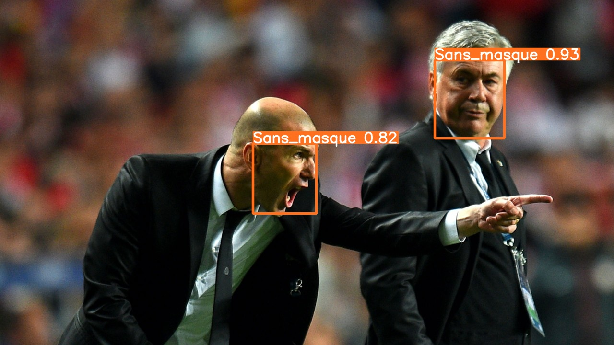

# Mask Detection Based on YOLOv5 pytorch


The project is a requirement for completing the Computer Vision module at Dakar Institute of Technology.
The aim of the project is to annotate images using Roboflow and then utilize an API to train the YOLOv5 
model, implementing PyTorch framework, on Google Colaboratory


We used a custom dataset (the wearing mask dataset from Roboflow) to train a YOLOv5 model
using the TensorFlow framework in Google Colab.
The input can be an image or a video, and the output will be a detection of whether a mask is being worn or not."

We used manual labelization on Roboflow, we have performed random resized cropping and a vertical flip to each image dataset. Besides that, we also make
the Dataset square images with a usual pixel size of 224 x 224 since most deep neural networks, including ResNet, 
require square images as input. according to [YOLOv5 Based Real-time Helmet and Mask ](https://www.aasmr.org/liss/Vol.9/No.3%202022/Vol.9.No.3.08.pdf) paper

We used 3261 images as the Dataset, and the Dataset is divided into a training set, testing set, and validation set 
with a ratio of 6:2:2. The Dataset is pre-processed, such as rotation and zooming, to increase object detection 
performance.  And those images are labelled with ‘With_Mask’ and ‘Without_Mask’, and ‘Incorrect_Mask’. The
photos are divided into a training set with 682 illustrations, a testing set with 96 images, and a validation set with
85 images. This study using YOLOv5 as the training model. This study obtains the greatest result in 300 epochs instead
of 500 epochs, which prove that the higher epochs doesn’t always mean the greater performance.


### Implementation
<hr>


transfer learning due to insufficient data samples

1. Clone Repo and install all dependencies

```python
!git clone https://github.com/ultralytics/yolov5  # clone repo
%cd yolov5
%pip install -qr requirements.txt # install dependencies
%pip install -q roboflow

import torch
import os
from IPython.display import Image, clear_output  # to display images

print(f"Setup complete. Using torch {torch.__version__} ({torch.cuda.get_device_properties(0).name if torch.cuda.is_available() else 'CPU'})")
```


**Step 2.  Install roboflow and import dataset using roboflow API**

```python
!pip install roboflow

from roboflow import Roboflow
rf = Roboflow(api_key="-------------------")
project = rf.workspace("ditnov202").project("face_mask_detection-wfniz")
dataset = project.version(1).download("yolov5")
```


**Step 3: Train Our Custom YOLOv5 model**

```python
!python train.py --img 640 --batch 80 --epochs 256 --data {dataset.location}/data.yaml --weights yolov5s.pt --cache
```

**4. Run the inference with the trained weight**

```python
!python detect.py --weights /content/yolov5/runs/train/exp3/weights/best.pt --img 640 --conf 0.1 --source /content/yolov5/data/images/zidane.jpg

```
**5. Display inference on ALL test images**

```python
import glob
from IPython.display import Image, display

for imageName in glob.glob('/content/yolov5/runs/detect/exp4/*.jpg'): #assuming JPG
    display(Image(filename=imageName))
    
!python detect.py --weights /content/yolov5/runs/train/exp3/weights/best.pt  --conf 0.25 --source '/content/Test_data'

#export the model's weights for future use
from google.colab import files
files.download('./runs/train/exp3/weights/best.pt')
```

 


###  The result
<hr>
Through these experiments, we observed
that the object background complexity will hugely affect the object detection result.
This study obtains a precision of 95% and 77% recall at the end of the study

This experiment contains 7959 images for the Dataset. In addition, this experiment uses Fine-tune as the transfer
learning strategy. They first pre-trained the PP-YOLO with the Dataset annotated in PascalVoc format, and a set of the Dataset with Mix-up data is sent to migration
training. This experiment obtains the highest 89.69% mAP by using PP-YOLO-mask. Through these experiments, we also can conclude that some enhancement strategy is
recommendable to enhance our model.

As mentioned before, this study has labelled the dataset into 5 classes, which are
"Head", "Helmet", "Incorrect Mask", "No Wearing Mask" and "Wearing Mask".
Consider the training environment and how to find the optimal batch size.
This study completed the model training with 3 different batch sizes. The training
per epochs in different batch sizes and the training loss are considerable values while Considering 
the time consumed and the accuracy and the training loss, this study found out that an epoch equal to 60 is the most suitable parameter for this study to
use. Even though precision resulted better in epochs 50, but the overall score shows
that the epochs 60 are consider good as well.

Difficulty while training the YOLOv5 model
This study has faced a major training environment problem. Due to the low-level
hardware, the training progress shall also consider some parameters that will affect
the hardware memory.


The Adam Optimizer using binary cross-entropy was
used to generate the model. The mark detection system was able to show excellent
result with accuracy of 97.8% with ResNet50.


